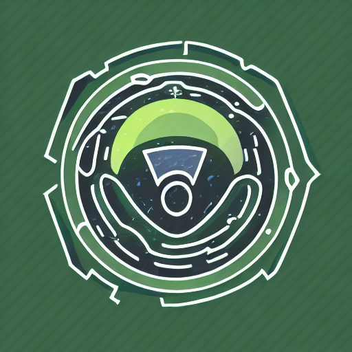

<!-- Improved compatibility of back to top link: See: https://github.com/othneildrew/Best-README-Template/pull/73 -->
<a name="readme-top"></a>
<!--
*** Thanks for checking out the Best-README-Template. If you have a suggestion
*** that would make this better, please fork the repo and create a pull request
*** or simply open an issue with the tag "enhancement".
*** Don't forget to give the project a star!
*** Thanks again! Now go create something AMAZING! :D
-->


<!-- PROJECT SHIELDS -->
<!--
*** I'm using markdown "reference style" links for readability.
*** Reference links are enclosed in brackets [ ] instead of parentheses ( ).
*** See the bottom of this document for the declaration of the reference variables
*** for contributors-url, forks-url, etc. This is an optional, concise syntax you may use.
*** https://www.markdownguide.org/basic-syntax/#reference-style-links
-->
[![Contributors][contributors-shield]][contributors-url]
[![Forks][forks-shield]][forks-url]
[![Stargazers][stars-shield]][stars-url]
[![Issues][issues-shield]][issues-url]
[![LinkedIn][linkedin-shield]][linkedin-url]


<!-- PROJECT LOGO -->
<br />
<div align="center">
  <a href="https://github.com/CommanderAstern/Flowtopia">
    
  </a>

<h3 align="center">Flowtopia</h3>

  <p align="center">
    Enter a dynamic 3D metaverse where you can connect, compete, and customize with players from around the world. Build your own virtual identity and explore a world of endless possibilities
    <br />
    <br />
    <a href="https://drive.google.com/file/d/1ub7fCKZdwhkmKHZ6-7y-sKDaxV_D_er9/view?usp=sharing">Download APK</a>
    ·
    <a href="https://www.canva.com/design/DAFb7j9MvnU/sTkqU-Kvw7V8H2BKPAxXJg/edit?utm_content=DAFb7j9MvnU&utm_campaign=designshare&utm_medium=link2&utm_source=sharebutton">Pitch Deck</a>
    ·
    <a href="https://github.com/CommanderAstern/Flowtopia/issues">Request Feature</a>
  </p>
</div>


<!-- TABLE OF CONTENTS -->
<details>
  <summary>Table of Contents</summary>
  <ol>
    <li>
      <a href="#about-the-project">About The Project</a>
      <ul>
        <li><a href="#built-with">Built With</a></li>
      </ul>
    </li>
    <li>
      <a href="#getting-started">Getting Started</a>
      <ul>
        <li><a href="#prerequisites">Prerequisites</a></li>
        <li><a href="#installation">Installation</a></li>
      </ul>
    </li>
    <li><a href="#roadmap">Roadmap</a></li>
    <li><a href="#contributing">Contributing</a></li>
    <li><a href="#contact">Contact</a></li>
  </ol>
</details>


<!-- ABOUT THE PROJECT -->
## About The Project

![Product Name Screen Shot][product-screenshot]
The 3D metaverse game provides a virtual environment where people can connect and interact with each other from anywhere in the world. This game offers a unique and engaging way for people to socialize and connect with others in a digital and immersive format.

The virtual economy in the game allows players to buy, sell, and trade virtual items using blockchain technology, creating a secure and transparent marketplace for players to engage in virtual commerce.

Overall, the game offers a fun and interactive way for people to connect with others and participate in a virtual economy, all while providing a safe and secure environment.
<p align="right">(<a href="#readme-top">back to top</a>)</p>


### Built With

* Unity
* C#
* Flow Unity SDK
* Flow Blockchain

<p align="right">(<a href="#readme-top">back to top</a>)</p>


<!-- GETTING STARTED -->
## Getting Started

### Prerequisites

You need the following software to run this project:
* Unity 2020.3.0f1
* Visual Studio 2019
* Flow CLI

### Installation

1. Clone the repo
   ```sh
   git clone
    ```
2. Open the project in Unity
3. Open the ParkScene scene
4. Build the project
5. Run the executable file

### Adding new accounts
1. Open the ParkScene scene
2. Open the Flow Control GameObject
3. In the Flow Control GameObject, click on the `Open Flow Control Window` Button.
3. Add a new account by clicking the "Add Account" button
4. Enter the account's private key

<p align="right">(<a href="#readme-top">back to top</a>)</p>


<!-- ROADMAP -->
## Roadmap

- [ ] Better NFT Contract Implementation
- [ ] Major UI Overhaul

See the [open issues](https://github.com/CommanderAstern/Flowtopia/issues) for a full list of proposed features (and known issues).

<p align="right">(<a href="#readme-top">back to top</a>)</p>


<!-- CONTRIBUTING -->
## Contributing

Contributions are what make the open source community such an amazing place to learn, inspire, and create. Any contributions you make are **greatly appreciated**.

If you have a suggestion that would make this better, please fork the repo and create a pull request. You can also simply open an issue with the tag "enhancement".
Don't forget to give the project a star! Thanks again!

1. Fork the Project
2. Create your Feature Branch (`git checkout -b feature/AmazingFeature`)
3. Commit your Changes (`git commit -m 'Add some AmazingFeature'`)
4. Push to the Branch (`git push origin feature/AmazingFeature`)
5. Open a Pull Request

<p align="right">(<a href="#readme-top">back to top</a>)</p>


<!-- CONTACT -->
## Contact

Asim Jawahir - [@AsimJawahir](https://twitter.com/AsimJawahir) - asimjawahir123@gmail.com

Rahul Pujari - [@EmperorRP](https://twitter.com/therahulpujari) - rahulpujari2919@gmail.com

Project Link: [https://github.com/CommanderAstern/Flowtopia](https://github.com/CommanderAstern/Flowtopia)

<p align="right">(<a href="#readme-top">back to top</a>)</p>


<!-- ACKNOWLEDGMENTS -->
## Acknowledgments

* [Best-Readme-Template](https://github.com/othneildrew/Best-README-Template)
<p align="right">(<a href="#readme-top">back to top</a>)</p>


<!-- MARKDOWN LINKS & IMAGES -->
<!-- https://www.markdownguide.org/basic-syntax/#reference-style-links -->
[contributors-shield]: https://img.shields.io/github/contributors/CommanderAstern/Flowtopia.svg?style=for-the-badge
[contributors-url]: https://github.com/CommanderAstern/Flowtopia/graphs/contributors
[forks-shield]: https://img.shields.io/github/forks/CommanderAstern/Flowtopia.svg?style=for-the-badge
[forks-url]: https://github.com/CommanderAstern/Flowtopia/network/members
[stars-shield]: https://img.shields.io/github/stars/CommanderAstern/Flowtopia.svg?style=for-the-badge
[stars-url]: https://github.com/CommanderAstern/Flowtopia/stargazers
[issues-shield]: https://img.shields.io/github/issues/CommanderAstern/Flowtopia.svg?style=for-the-badge
[issues-url]: https://github.com/CommanderAstern/Flowtopia/issues
[license-shield]: https://img.shields.io/github/license/CommanderAstern/Flowtopia.svg?style=for-the-badge
[license-url]: https://github.com/CommanderAstern/Flowtopia/blob/master/LICENSE.txt
[linkedin-shield]: https://img.shields.io/badge/-LinkedIn-black.svg?style=for-the-badge&logo=linkedin&colorB=555
[linkedin-url]: https://linkedin.com/in/asimjawahir
[product-screenshot]: ./images/FlowTopia.png
[Next.js]: https://img.shields.io/badge/next.js-000000?style=for-the-badge&logo=nextdotjs&logoColor=white
[Next-url]: https://nextjs.org/
[React.js]: https://img.shields.io/badge/React-20232A?style=for-the-badge&logo=react&logoColor=61DAFB
[React-url]: https://reactjs.org/
[Vue.js]: https://img.shields.io/badge/Vue.js-35495E?style=for-the-badge&logo=vuedotjs&logoColor=4FC08D
[Vue-url]: https://vuejs.org/
[Angular.io]: https://img.shields.io/badge/Angular-DD0031?style=for-the-badge&logo=angular&logoColor=white
[Angular-url]: https://angular.io/
[Svelte.dev]: https://img.shields.io/badge/Svelte-4A4A55?style=for-the-badge&logo=svelte&logoColor=FF3E00
[Svelte-url]: https://svelte.dev/
[Laravel.com]: https://img.shields.io/badge/Laravel-FF2D20?style=for-the-badge&logo=laravel&logoColor=white
[Laravel-url]: https://laravel.com
[Bootstrap.com]: https://img.shields.io/badge/Bootstrap-563D7C?style=for-the-badge&logo=bootstrap&logoColor=white
[Bootstrap-url]: https://getbootstrap.com
[JQuery.com]: https://img.shields.io/badge/jQuery-0769AD?style=for-the-badge&logo=jquery&logoColor=white
[JQuery-url]: https://jquery.com 
